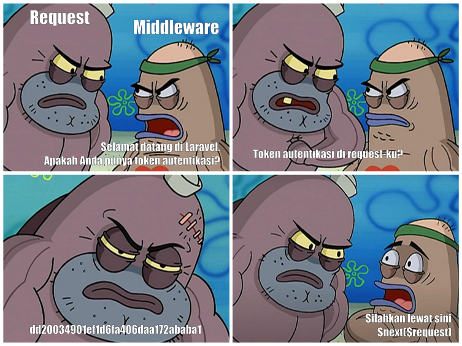
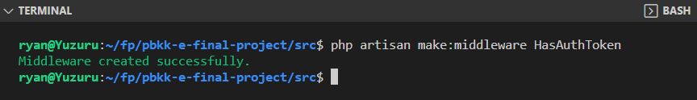
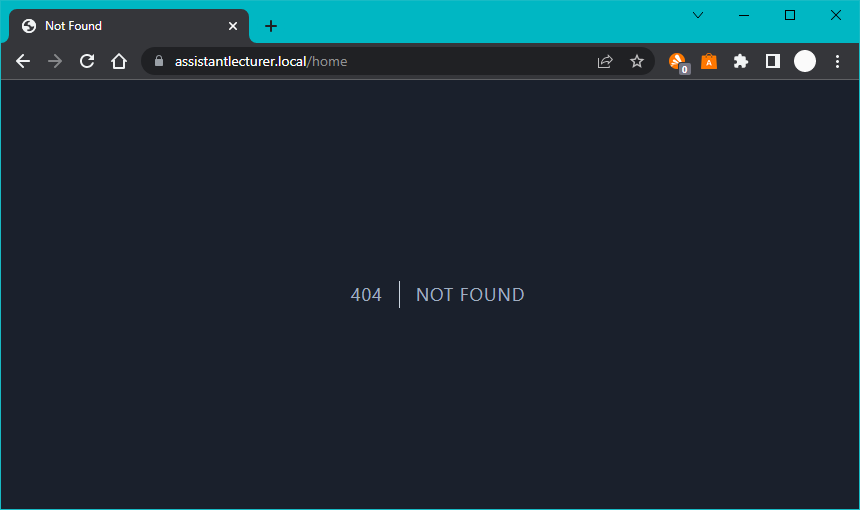
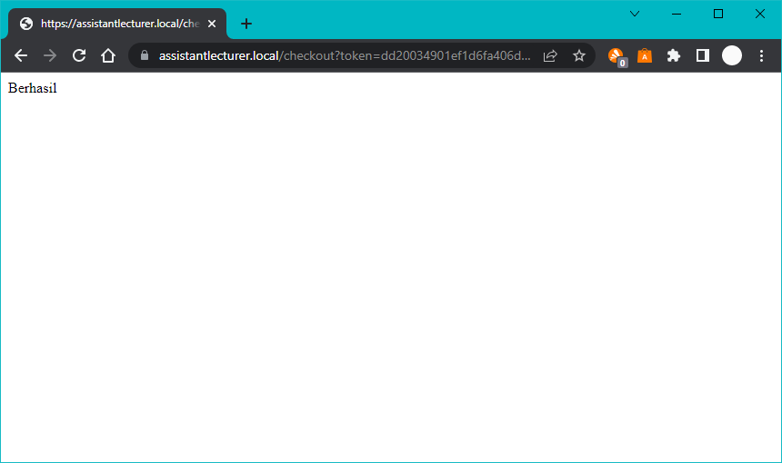

# Laravel Middleware

[Kembali](readme.md)

## Daftar Isi

-   [Laravel Middleware](#laravel-middleware)
    -   [Daftar Isi](#daftar-isi)
    -   [Latar Belakang Topik](#latar-belakang-topik)
    -   [Konsep](#konsep)
        -   [Apa itu Middleware?](#apa-itu-middleware?)
    -   [Tutorial](#tutorial)
        -   [Langkah 1 - Buat Middleware](#buat-middleware)
        -   [Langkah 2 - Coding Middleware](#coding-middleware)
        -   [Langkah 3 - Aktifkan Middleware](#aktifkan-middleware)
        -   [Langkah 4 - Tes Middleware](#tes-middleware)
    -   [TIPS](#tips)
    -   [Kesimpulan](#kesimpulan)

## Latar Belakang Topik

Kadang-kadang kita perlu mengecek permission ketika user mengakses halaman website kita.
Misalnya kita mempunyai website Online Shop.
Di website ini, user yang belum login tidak boleh mengakses halaman http://localhost/checkout karena ada aturan bisnis yang menyatakan bahwa user harus login sebelum membeli barang.
Untuk membuat fitur ini, kita dapat menggunakan middleware.
Di materi ini, kita akan mengimplementasikan middleware dengan berbagai macam contoh.

## Konsep

### Apa itu Middleware?

"Middleware adalah mekanisme penyaringan request"

Berikut ini ilustrasi middleware di Laravel. 
Di gambar ini, aplikasi diibaratkan sebuah bola dan middleware diibaratkan sebuah lapisan di bola yang melindungi lapisan di dalamnya. 
Ketika user mengakses halaman website, user mengirimkan request melalui browser.
Request-nya akan melewati lapisan terluar dari bola (middleware).
Middleware dapat menentukan apakah request-nya layak diteruskan ke dalam bola atau tidak.


Berikut ini meme yang relevan.



## Tutorial

### 1. Buat Middleware

Kita beri nama Middleware yang akan kita buat dengan "HasAuthToken". 
Buka terminal kemudian masuk ke root folder laravel. 
Ketik command di bawah ini.

```bash
php artisan make:middleware HasAuthToken
```



Setelah command di atas dijalankan. Kita dapat melihat bahwa sebuah file yang bernama HasAuthToken.php muncul di folder /app/Http/Middleware.
Kemudian, kita harus memberitahu Laravel bahwa ada middleware baru.
Caranya adalah kita buka file /app/Http/Kernel.php.
Di dalam file tersebut, cari variabel array $routeMiddleware kemudian tambahkan middleware HasAuthToken.
```php
    protected $routeMiddleware = [
        ...
        'has-auth-token' => \App\Http\Middleware\HasAuthToken::class,
    ];
```

### 2. Coding Middleware

Middleware yang telah kita buat belum melakukan apa-apa. 
Kita buka file /app/Http/Middleware/HasAuthToken.php kemudian kita implementasi kode seperti pada meme sebelumnya.

```php
class HasAuthToken
{
    /**
     * Handle an incoming request.
     *
     * @param  \Illuminate\Http\Request  $request
     * @param  \Closure(\Illuminate\Http\Request): (\Illuminate\Http\Response|\Illuminate\Http\RedirectResponse)  $next
     * @return \Illuminate\Http\Response|\Illuminate\Http\RedirectResponse
     */
    public function handle(Request $request, Closure $next)
    {
        if ($request->input('token') !== 'dd20034901ef1d6fa406daa172ababa1') {
            return redirect("home");
        }
        return $next($request);
    }
}
```

### 3. Aktifkan Middleware

Kita perlu mengaktifkan middleware di halaman website kita. 
Misalnya, kita mempunyai halaman /checkout.
Kita buka /routes/web.php dan tambahkan middleware di halaman /checkout.

Ada beberapa cara untuk mengaktifkan middleware.
#### Cara 1: Untuk satu URL
Misalnya kita ingin middleware HasAuthToken aktif di halaman /checkout saja.
Kita dapat menuliskan kode seperti di bawah ini.
```php
Route::get('/checkout', function () {
    return "Berhasil";
})->middleware('has-auth-token');
```
#### Cara 2: Untuk lebih dari satu URL
Misalnya kita ingin middleware HasAuthToken aktif di halaman /profile dan /checkout.
Kita dapat menuliskan kode seperti di bawah ini.
```php
Route::middleware('has-auth-token')->group(function() {
    Route::get('/profile', function () { return "Profile"; });
    Route::get('/checkout', function () { return "Profile"; });
});
```
#### Cara 3: Untuk semua URL
Kita buka Kernel.php kemudian tambahkan middleware di variabel array $middleware.
```php
protected $middleware = [
    ...,
    \App\Http\Middleware\HasAuthToken::class,
];
```

### 4. Tes Middleware
Kita akses halaman /checkout tanpa token atau dengan token yang salah. Kemudian, kita akan dialihkan ke halaman /home oleh Middleware.



Kita akses halaman /checkout dengan token yang benar. Kita akan mendapatkan teks "Berhasil".



## TIPS
### Mengaktifkan lebih dari satu middleware pada suatu halaman
Kita dapat mengaktifkan lebih dari satu middleware pada suatu halaman dengan mengganti parameter dari fungsi middleware(string) menjadi middleware(string[]).
Misalnya kita ingin mengaktifkan middleware has-auth-token dan active-account di halaman /profile dan /checkout. 
Maka kita dapat menuliskan kode di route.php seperti di bawah ini.
```php
Route::middleware(['has-auth-token', 'active-account'])->group(function() {
    Route::get('/profile', function () { return "Profile"; });
    Route::get('/checkout', function () { return "Berhasil"; });
});
```

## Kesimpulan

Laravel Middleware berfungsi sebagai filter request dari pengguna yang akan dicek kelayakannya.
