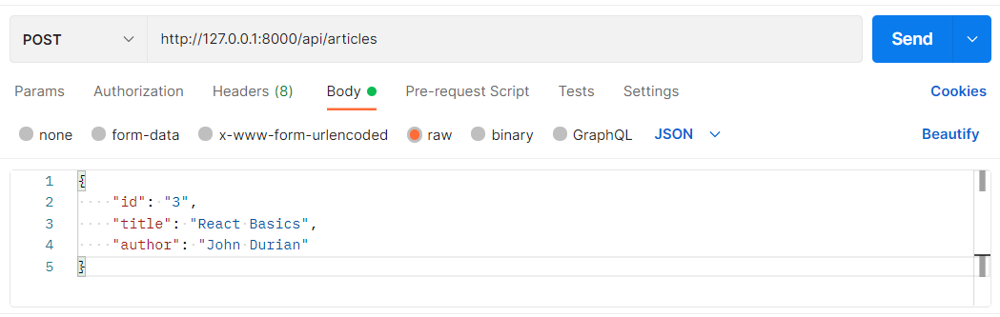

# Laravel Route Dasar

[Kembali](readme.md)

## Daftar Isi

- [Laravel Route Dasar](#laravel-route-dasar)
  - [Daftar Isi](#daftar-isi)
  - [Latar Belakang Topik](#latar-belakang-topik)
  - [Konsep-Konsep](#konsep-konsep)
    - [Uniform Resource Identifier (URI)](#uniform-resource-identifier-uri)
    - [Uniform Resource Locator (URL)](#uniform-resource-locator-url)
    - [Laravel Route](#laravel-route)
      - [Metode Route yang Tersedia (Laravel 9.x)](#metode-route-yang-tersedia-laravel-9x)
  - [Inisialisasi Project Laravel](#inisialisasi-project-laravel)
  - [Langkah-Langkah Tutorial](#langkah-langkah-tutorial)
    - [Route Web Interface](#route-web-interface)
      - [Langkah Pertama](#langkah-pertama)
      - [Langkah Kedua](#langkah-kedua)
      - [Langkah Ketiga](#langkah-ketiga)
      - [Langkah Keempat](#langkah-keempat)
    - [Route API](#route-api)
      - [Langkah Pertama](#langkah-pertama-1)
      - [Langkah Kedua](#langkah-kedua-1)
      - [Langkah Ketiga](#langkah-ketiga-1)
  - [Referensi](#referensi)

## Latar Belakang Topik

Dalam mengakses sebuah web, route adalah bagian yang mengatur rute pada project aplikasi web. Hal paling mendasar pada route di Laravel adalah biasanya route menerima URI (sekuen karakter unik yang memberikan identifikasi terhadap teknologi web) serta closure (fungsi anonim). Penggunaan kedua hal tersebut akan memudahkan kita mengatur project Laravel nantinya.


Misal kita ingin membangun web. Tentu, agar lebih terorganisasi, kita ingin akses web kita dapat diakses selayaknya directory pada operating system. Pada contoh ini, kita akan membangun route di mana memberikan akses URI “/pegawai” yang menampilkan view welcome. Tentu untuk melakukan penggunaan itu, penggunaan route Laravel akan memudahkan dalam mengakses lokasi URI tersebut. Kita juga nantinya, dapat pula melakukan redirecting view misal dari “/employee” di mana employee dan pegawai memiliki arti yang sama agar bisa mengakses link pegawai pada akhirnya.

Banyaknya fitur tersebut lah yang akan kita pelajari pada konsep Laravel Route.

## Konsep-Konsep

### Uniform Resource Identifier (URI)

URI adalah string identifier yang merujuk pada suatu resource di internet. URI memiliki dua subset, yaitu Uniform Resource Locator (URL) dan Uniform Resource Number (URN). Pada umumnya, URI memiliki syntax seperti berikut.

```
scheme:[//authority]path[?query][#fragment]
```

* **Scheme**: Urutan karakter yang merupakan kombinasi huruf, angka, tanda tambah, atau garis bawah (_) dan diikuti dengan titik dua (:)
* **Authority**: Komponen opsional yang diawali dengan dua garis miring (//) dan memiliki 3 sub komponen, yaitu:
  * **userinfo**: Username dan password opsional yang dipisah dengan titik dua (:) dan diakhir dengan simbol `@`
  * **host**: IP address atau nama domain. IP address dibungkus dengan bracket ([])
  * **port**: Port yang digunakan (opsional)
* **Path**: Urutan segment path yang dipisah dengan garis miring (/)
* **Query**: Komponen opsional yang diawali dengan tanda tanya (?) dan berisi query string
* **Fragment**: Komponen opsional yang diawali dengan tanda pagar (#) dan berisi fragment identifier yang memberi arah ke secondary resource

Contoh URI:


### Uniform Resource Locator (URL)


URL digunakan untuk mendapatkan lokasi dari resource di web. URL merupakan suatu referensi untuk sebuah resource dan salah satu cara untuk mengakses resource tersebut. URL selalu menampilkan resource yang unik, seperti HTML page dan gambar. Pada umumnya, URL memiliki syntax seperti berikut.

```
scheme:[//authority]path[?query][#fragment]
```

* **Scheme**: Protokol yang digunakan browser untuk mengakses resource, umumnya adalah HTTP dan HTTPS
* **Authority**: Nama domain dan port yang dipisahkan dengan titik dua (:)
* **Path**: Path lengkap dari resource
* **Query string**: String yang berisi pasangan name dan value yang diawali dengan tanda tanya (?) dan setiap pasangan name dan value dipisahkan dengan tanda ampersand (&)
* **Fragment**: Komponen opsional yang diawali dengan tanda pagar (#) dan berisi fragment identifier yang memberi arah ke secondary resource

Contoh URL:


### Laravel Route

Konsep dari Laravel Route ini akan terbagi menjadi dua, yakni route api dan route web. Route api ini secara otomatis akan menambahkan “/api” pada bagian awal router. Sedangkan, route web akan memberikan akses penuh terhadap route. Secara default keseluruhan file route ini dapat diakses pada directory “routes” tergantung apakah kita ingin mengakses web (`routes\web.php`) atau api (`routes\api.php`). Seluruh file pada route ini diatur secara otomatis oleh `App\Providers\RouteServiceProvider`.

#### Metode Route yang Tersedia (Laravel 9.x)

```
Route::get($uri, $callback);
Route::post($uri, $callback);
Route::put($uri, $callback);
Route::patch($uri, $callback);
Route::delete($uri, $callback);
Route::options($uri, $callback);
```

## Inisialisasi Project Laravel
Sebelum kita memulai project Laravel, kita dapat melakukan [instalasi Laravel](https://laravel.com/docs/8.x/installation). Terdapat banyak cara untuk menginstall project Laravel, namun di sini kita akan menggunakan composer.

```
composer create-project laravel/laravel laravel-tutorial

cd laravel-tutorial

php artisan serve
```

Nantinya, akan terbuat folder laravel-tutorial sebagai berikut.


Selain itu, setelah kita memasukkan command `php artisan serve` maka kita akan mendapatkan akses development server aplikasi Laravel seperti berikut.


Jika kita mengakses development server tersebut, maka kita dapatkan tampilan sebagai berikut.


## Langkah-Langkah Tutorial

### Route Web Interface

Pada bagian ini akan dijelasakan cara membuat route untuk web interface.

#### Langkah Pertama

Sekarang kita akan membangun contoh view sederhana untuk URI “/pegawai”. Di sini, kita mengakses `resources\views`. Akan terlihat file `welcome.blade.php`. Lakukan copy file tersebut dan hasilnya ganti menjadi `welcome-pegawai.blade.php`.


Setelah itu, ganti isi body menjadi:

```html
<body class="antialiased">
    <div
        class="relative flex items-top justify-center min-h-screen bg-gray-100 dark:bg-gray-900 sm:items-center py-4 sm:pt-0"
        style="font-size: 3em"
    >
        Laravel Pegawai
    </div>
</body>
```

#### Langkah Kedua

Setelah ini, kita mencoba untuk membangun router ke URI “/pegawai”. Di sini, mulanya kita membuat akses route pada file `routes\web.php`.


Dapat kita lihat bahwa di sini, terdapat class `Route` dengan method `get`. Ini merupakan method dalam melakukan akses HTTP terhadap web aplikasi Laravel. Dapat dilihat pula, parameter dari method ini sebagai berikut:
`‘/’` sebagai URI
`function()` sebagai Closure untuk menjalankan proses

Sekarang, kita menentukan [HTTP request method](https://developer.mozilla.org/en-US/docs/Web/HTTP/Methods) yang diinginkan. Karena kita hanya menampilkan data view sederhana kita akan memakai `GET` sebagai request method-nya. Selanjutnya, kita tinggal menggunakan kode berikut.

```php
Route::get('/pegawai', function () {
    return view('welcome-pegawai');
});
```

Langkah Ketiga - versi 2
Adapun karena kita hanya menampilkan view, kita juga dapat menggunakan method `view` yang nantinya mengambil parameter URI dan nama file view.

```php
Route::view("/pegawai", "welcome-pegawai");
```

#### Langkah Ketiga

Sekarang kita coba memanggil command `php artisan serve`. Maka tampilannya akan menjadi sebagai berikut.


#### Langkah Keempat

Sekarang kita akan membuat redirect dari “/employee” menuju route “/pegawa”. Untuk melakukan hal ini, kembali ke file `routes\web.php`. Di sini, kita akan menggunakan method `redirect` yang mengambil dua parameter, yakni URI asal dan URI tujuan.

```
Route::redirect("/employee", "/pegawai");
```

Jika kita menjalankan command `php artisan serve` dan mengakses URI “/employee”, maka kita akan diarahkan segera ke route “/pegawai”.

### Route API

Pada bagian ini akan dijelasakan cara membuat route untuk API.

#### Langkah Pertama

Buka file `routes/api.php` dan tambahkan kode berikut. Route `/articles` dapat merespon HTTP verb `GET` dan `POST`. Metode `GET` umumnya digunakan untuk mendapatkan semua atau beberapa resource (read) dan metode `POST` umumnya digunakan untuk membuat sebuah resource baru (create).

```php
Route::get('articles', ...);

Route::post('articles', ...);
```

#### Langkah Kedua

Definisikan fungsi callback untuk setiap route. Route `/articles` untuk metode `GET` memiliki fungsi callback untuk mendapatkan data articles (seharusnya berasal dari database, tetapi dalam tutorial ini digunakan data mock) dan mengembalikan data tersebut ke client. Route `/articles` untuk metode `POST` memiliki fungsi callback untuk menerima request dari client, mengolah request (menyimpan data, tetapi dalam tutorial ini tidak disimpan), dan mengembalikan response ke client.

```php
Route::get('articles', function() {
    // mendapatkan semua data dari database di sini
    // contoh data
    $articles = [
        [
            "id"=>"1",
            "title"=>"Laravel 8 Basics",
            "author"=>"John Lemon"
        ],
        [
            "id"=>"2",
            "title"=>"Express Basics",
            "author"=>"John Mango"
        ]
    ];
    return $articles;
});

Route::post('articles', function(Request $request) {
    // menyimpan data ke database di sini
    // contoh response
    $response = [
        "request"=>$request->json()->all(),
        "msg"=>"Article is successfully posted"
    ];
    return $response;
});
```

#### Langkah Ketiga

Buka Postman dan coba lakukan request dengan metode `GET` ke route `http://[alamat server]/api/articles`. Hasil yang diperoleh adalah sebagai berikut.


Coba lakukan request dengan metode `POST` ke route `http://[alamat server]/api/articles` dengan payload sebagai berikut.



Hasil yang diperoleh adalah sebagai berikut.


## Referensi
* Routing: https://laravel.com/docs/9.x/routing
* URI vs URL | Difference between URI and URL: https://www.javatpoint.com/uri-vs-url